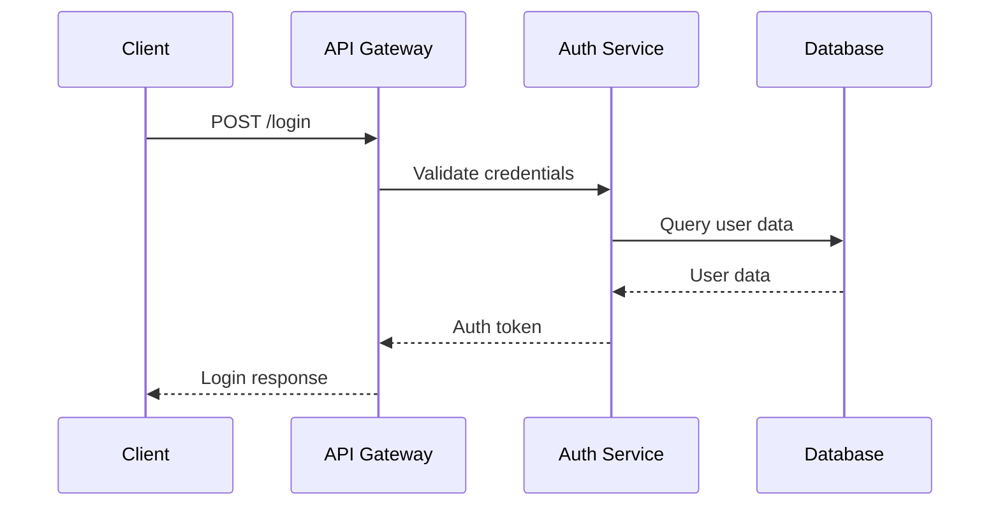
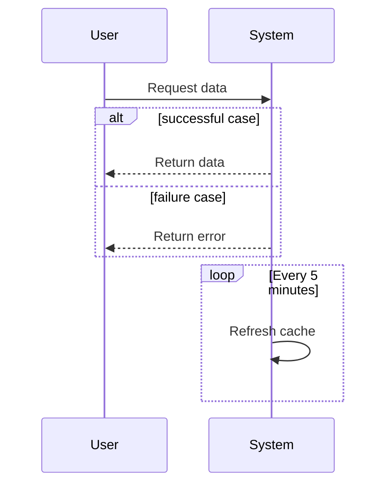
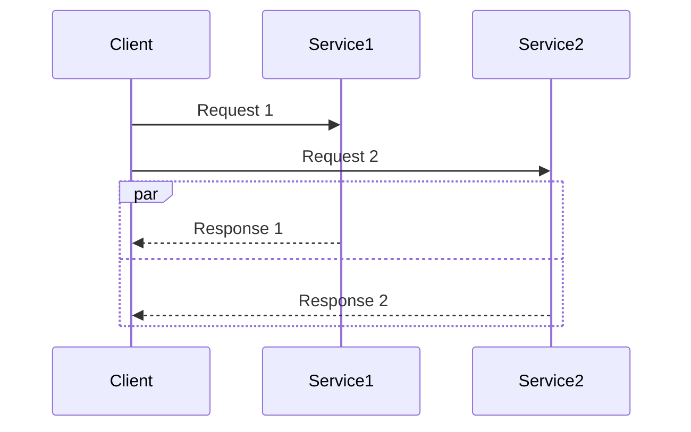
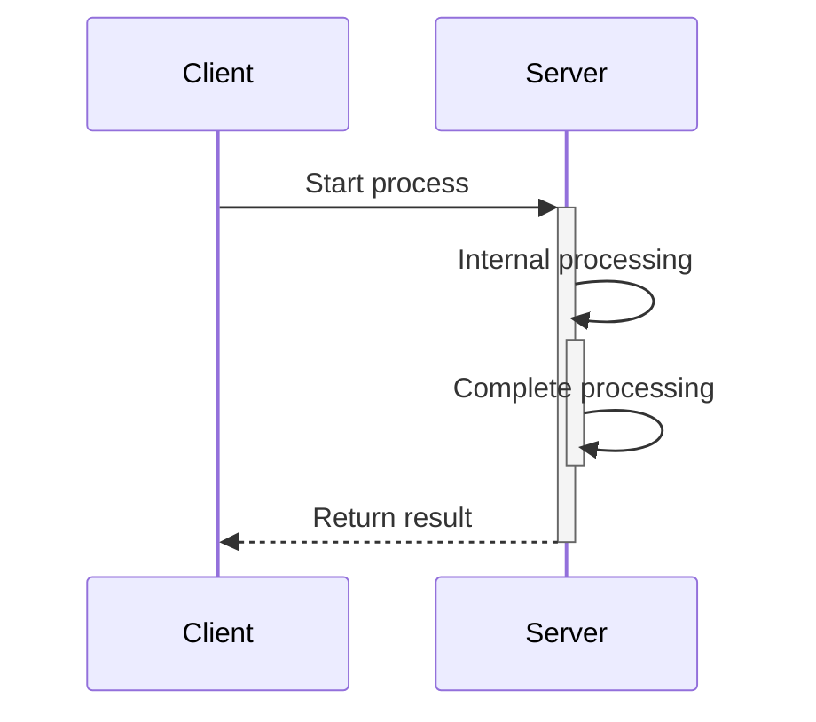
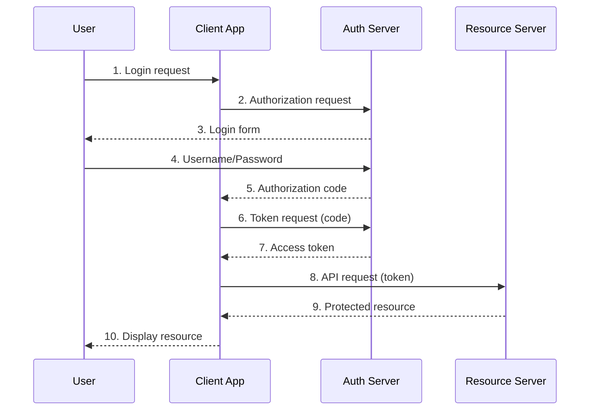
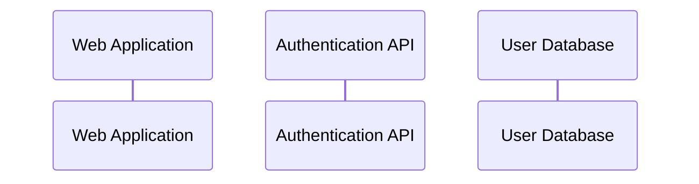
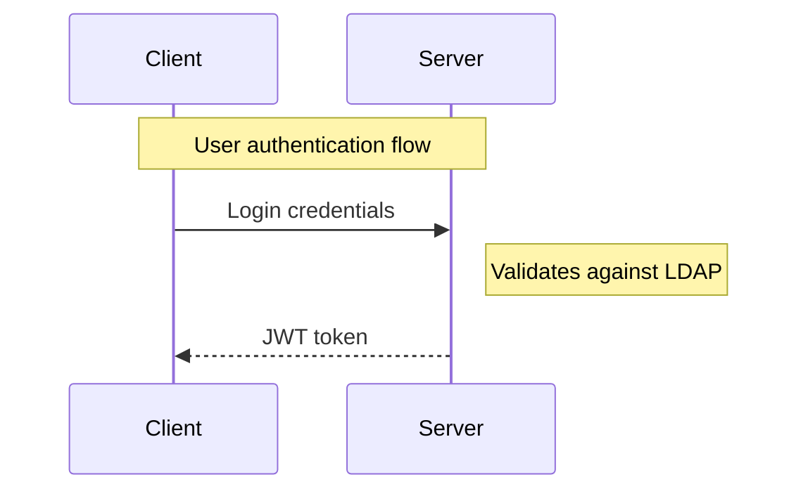
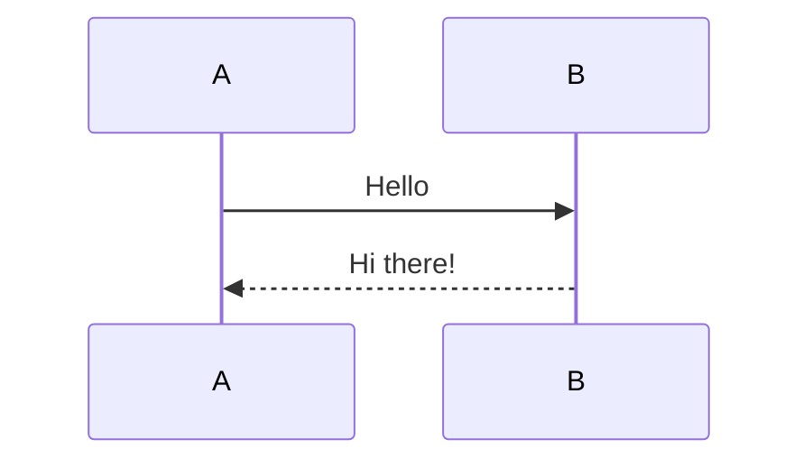

Sequence diagrams are essential tools for documenting system interactions and API flows. With Mermaid's text-based syntax and VS Code's powerful extensions, you can create professional sequence diagrams without leaving your editor. This guide will show you how to set up and use Mermaid in VS Code for creating sequence diagrams efficiently.

## What is Mermaid?

Mermaid is a JavaScript-based diagramming and charting tool that renders Markdown-inspired text definitions to create and modify diagrams dynamically. It's particularly popular for:

- Sequence diagrams
- Flowcharts
- Gantt charts
- Class diagrams
- State diagrams
- And much more

The power of Mermaid lies in its text-based approach, making diagrams version-controllable and easy to maintain alongside your code.

## Setting Up VS Code for Mermaid

### 1. Install the Mermaid Preview Extension

The most popular extension is **Mermaid Preview** by Vstirbu:

1. Open VS Code
2. Go to Extensions (Ctrl+Shift+X / Cmd+Shift+X)
3. Search for "Mermaid Preview"
4. Install the extension by Vstirbu

### 2. Alternative Extensions

You can also consider these alternatives:
- **Markdown Preview Mermaid Support**: Adds Mermaid support to the built-in Markdown preview
- **Mermaid Markdown Syntax Highlighting**: Provides syntax highlighting for Mermaid code blocks

## Creating Your First Sequence Diagram

### Basic Sequence Diagram Syntax

Create a new file with `.md` extension and add a Mermaid code block:

```markdown

```

### Key Syntax Elements

**Participants**: Define the actors in your sequence
```mermaid
participant A as Client
participant B as Server
```

**Messages**: Show interactions between participants
- `A->>B`: Solid arrow (synchronous call)
- `A-->>B`: Dashed arrow (asynchronous response)
- `A->>+B`: Arrow with activation box
- `A->>-B`: Arrow ending activation box

**Notes**: Add explanatory text
```mermaid
Note over A,B: This happens simultaneously
Note right of A: Client validates input
```

## Advanced Sequence Diagram Features

### 1. Loops and Conditions



### 2. Parallel Operations



### 3. Activation Boxes



## Real-World Example: OAuth Flow

Here's a practical example showing an OAuth authentication flow:



## Best Practices

### 1. Keep It Simple
- Focus on the main flow
- Avoid too many participants in one diagram
- Break complex flows into multiple diagrams

### 2. Use Meaningful Names


### 3. Add Context with Notes


### 4. Version Control Integration
Since Mermaid diagrams are text-based, they work perfectly with Git:
- Track changes in diagram logic
- Review diagram updates in pull requests
- Maintain diagrams alongside code

## VS Code Tips and Tricks

### 1. Live Preview
With the Mermaid Preview extension:
- Open your `.md` file
- Use `Ctrl+Shift+P` (Cmd+Shift+P on Mac)
- Type "Mermaid: Preview" to open live preview

### 2. Export Options
Many extensions allow you to export diagrams as:
- PNG images
- SVG files
- PDF documents

### 3. Syntax Highlighting
Enable Mermaid syntax highlighting in code blocks by installing the appropriate extension.

## Integration with Documentation

### 1. GitHub/GitLab Support
Most Git platforms now support Mermaid rendering directly in Markdown files:

```markdown

```

### 2. Documentation Sites
Popular documentation generators support Mermaid:
- GitBook
- MkDocs
- Docusaurus
- VuePress

## Common Pitfalls and Solutions

### 1. Syntax Errors
- Always check participant names match exactly
- Ensure proper arrow syntax (`->>` not `->`)
- Validate indentation in loops and conditions

### 2. Performance Issues
- Large diagrams can be slow to render
- Consider breaking into smaller, focused diagrams
- Use sequence fragments for complex flows

### 3. Styling Limitations
- Mermaid has limited styling options
- Focus on content over appearance
- Use consistent naming conventions

## Conclusion

Mermaid sequence diagrams with VS Code extensions provide a powerful combination for creating and maintaining system documentation. The text-based approach ensures your diagrams stay in sync with your code and can be version-controlled effectively.

Key takeaways:
- Install Mermaid Preview extension for VS Code
- Start with simple diagrams and add complexity gradually
- Use meaningful participant names and add context with notes
- Leverage version control for diagram maintenance
- Export diagrams for presentations and documentation

Start creating your sequence diagrams today and improve your system design documentation workflow!

## Resources

- [Mermaid Official Documentation](https://mermaid-js.github.io/mermaid/)
- [Mermaid Live Editor](https://mermaid.live/) - Online editor for testing
- [VS Code Mermaid Preview Extension](https://marketplace.visualstudio.com/items?itemName=vstirbu.vscode-mermaid-preview)
- [Sequence Diagram Tutorial](https://mermaid-js.github.io/mermaid/#/sequenceDiagram)